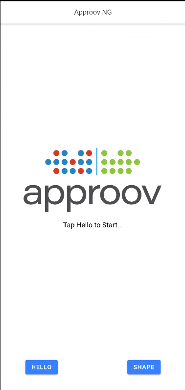
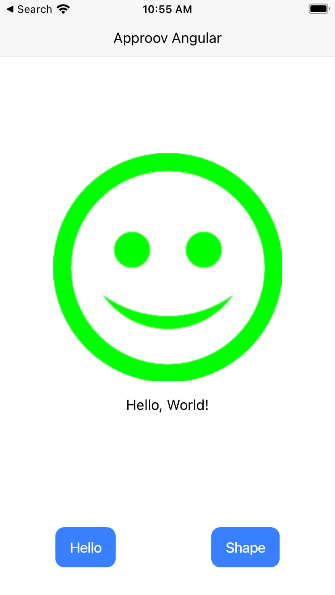
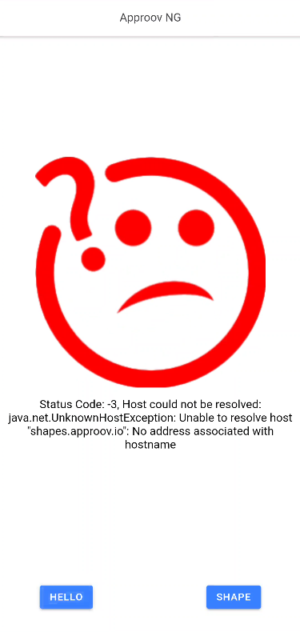
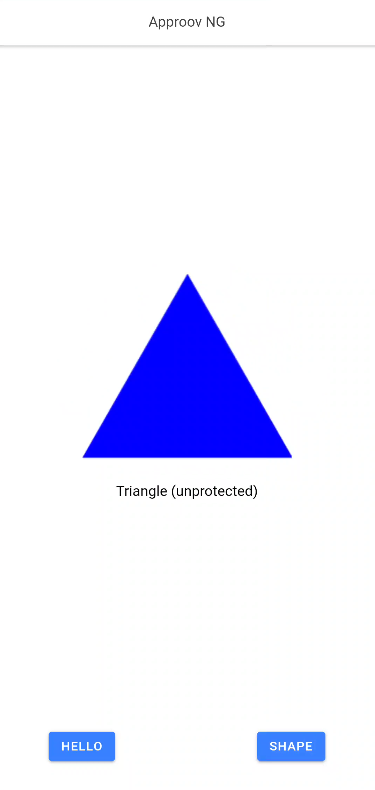
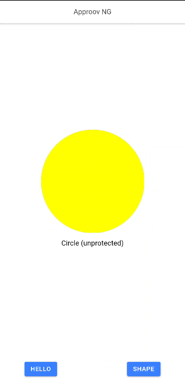
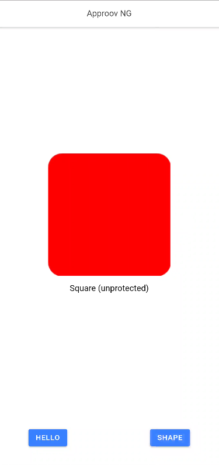
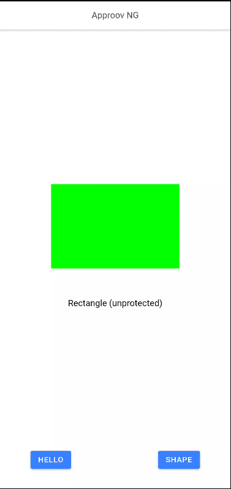
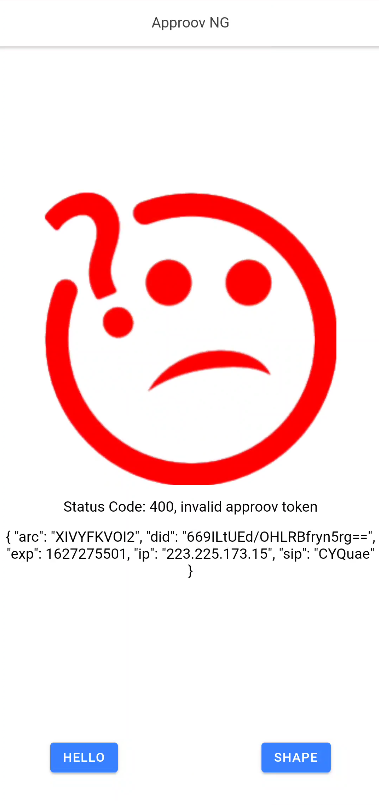

# Approov Quickstart: Ionic (Angular, Vue, React)

This quickstart is written specifically for Android and iOS apps that are implemented using the [`Cordova Advanced HTTP networking plugin`](https://www.npmjs.com/package/cordova-plugin-advanced-http). If this is not your situation then check if there is a more relevant Quickstart guide available.

## WHAT YOU WILL NEED
* Access to a trial or paid Approov account
* The `approov` [command line tool](https://approov.io/docs/latest/approov-installation/) installed with access to your account
* The contents of the folder containing this README
* An iOS device if you are using the iOS platform. You may use an iOS simulator but the Approov SDK requires an actual iOS device in order to authenticate an application.
* XCode if targeting iOS development in order to edit codesigning options. Version 12.3 is used in this document.
* [Cocoapods](https://cocoapods.org) installed (you must use version 1.9+ which offers support for xcframeworks)
* [NodeJS](https://nodejs.org/en/) v14+ installed in the system.

## WHAT YOU WILL LEARN
* How to integrate Approov into a real app in a step by step fashion
* How to register your app to get valid tokens from Approov
* A solid understanding of how to integrate Approov into your own app that uses [`Ionic Capacitor`](https://capacitorjs.com/) and [`Approov Advanced HTTP`](https://github.com/approov/quickstart-ionic-advancedhttp/tree/main/plugins/approov-advanced-http)
* Some pointers to other Approov features

## RUNNING THE SHAPES APP WITHOUT APPROOV
The Shapes App is a simple Ionic application written in Typescript, HTML and CSS, using the Approov Advanced Http built on top of Cordova Advanced HTTP networking package.

<p>
    
</p>

The application consists mostly of boilerplate code, apart from the definitions of the shapes server’s URLs and setting up of the onclick callback for each of the buttons along the bottom of the screen.

The _Hello_ and _Shape_ buttons set up API requests to the shapes server, using the application’s http client. For example, the _Hello_ button initiates a `GET` request to the `shapes.approov.io/v1/hello` endpoint.

On a successful _hello_ request to `/v1/hello`, the client app will say hello with a smile, while a failure or unsuccessful response will return a frown with some explanation of the error. The purpose of this simple endpoint is really just to test connectivity and to verify that you have built, installed and run the demo app correctly.

<a>
    
</a>

<a>
    
</a>

A successful _shapes_ request to `/v1/shapes` returns one of four possible shapes:

<a>
    
</a>

<a>
    
</a>

<a>
    
</a>

<a>
    
</a>

Ensure that your system is set up for Ionic development setting up [Ionic CLI](https://ionicframework.com/docs/intro/cli).

To build and run the Ionic Shapes App, open a shell terminal at the `demos/cap-*` directory and type the following commands.

For Android:

```bash
$ rm -f package-lock.json # Fix for invalid checksum in local packages.
$ npm install
$ ionic build
$ ionic cap copy android
```

After running the last command, open android directory in Android Studio. From there we can run / debug and generate a final APK for our project.

For iOS:

```bash
$ rm -f package-lock.json # Fix for invalid checksum in local packages.
$ npm install
$ ionic build
$ ionic cap copy ios
```

After Running the above commands there is one more step that we need to follow.

```bash
$ cd ios/App
$ rm -f PodFile.lock
```

Update the PodFile and add `source 'https://github.com/approov/approov-ios-sdk.git'` at the top.

```PodFile
source 'https://github.com/approov/approov-ios-sdk.git'
platform :ios, '11.0'
use_frameworks!

# workaround to avoid Xcode caching of Pods that requires
# Product -> Clean Build Folder after new Cordova plugins installed
# Requires CocoaPods 1.6 or newer
install! 'cocoapods', :disable_input_output_paths => true

def capacitor_pods
  # Automatic Capacitor Pod dependencies, do not delete
  pod 'Capacitor', :path => '../../node_modules/@capacitor/ios'
  pod 'CapacitorCordova', :path => '../../node_modules/@capacitor/ios'
  pod 'CordovaPlugins', :path => '../capacitor-cordova-ios-plugins'
  pod 'CordovaPluginsStatic', :path => '../capacitor-cordova-ios-plugins'
  pod 'CordovaPluginsResources', :path => '../capacitor-cordova-ios-plugins'
  # Do not delete
end

target 'App' do
  capacitor_pods
  # Add your Pods here
end
```

Your source file should look similar to this. After editing this file executes the following command:

```bash
$ pod install --repo-update
```

Unfortunately, capacitor does not add [custom podspec sources](https://github.com/ionic-team/capacitor/issues/2774) automatically we have to do this process manually.

Running an iOS app requires codesigning. Open the Xcode project by executing the command below:

```bash
$ ionic cap open ios
```

Select your code signing team in the `Signing & Capabilities` section of the project. Also ensure you modify the app's `Bundle Identifier` so it contains a unique string (you can simply append your company name). This is to avoid Apple rejecting a duplicate `Bundle Identifier` when code signing is performed.
Also turn off the bitcode for the application off, Since, approov-ios-sdk does not ship with bitcode enabled.
Now you can run your application as any normal iOS App.

You should now be able to use the app to say hello and get shapes.

## ADDING APPROOV SUPPORT

Since this plugin is already fetches the Approov SDK during installation there is no need for any further setup.

To initialize the Approov Protection we can add this snippet anywhere in our application:

```ts
import { ApproovHttp } from '@ionic-native/approov-advanced-http';

// ...

ApproovHttp.initializeApproov();
```

### Select the Correct Shapes Endpoint

The Shapes server provides the app with shapes using multiple versions of an API: version 1 (https://shapes.approov.io/v1/shapes) which is _not_ protected by Approov, and version 2 (https://shapes.approov.io/v2/shapes) which _is_ protected by Approov.

Now that we’re using Approov, let’s switch to use version 2 of the Shapes API.

```ts
// Update the VERSION from v1 to v2 for approov activation 

// demos/cap-angular/src/app/app.component.ts@L15
VERSION: string = 'v2'; // Change To v2 when using Approov

// demos/cap-vue/src/App.vue@L62
const VERSION = 'v2'; // Change To v2 when using Approov

// demos/cap-react/src/App.tsx@L53
VERSION = "v2"; // Change To v2 when using Approov
```

There will be no need to make any extra change as the code will automatically initialize approov as soon as v2 is activated.

### Ensure the Shapes API is added in Approov CLI

In order for Approov tokens to be generated for `https://shapes.approov.io/v2/shapes` it is necessary to inform Approov about it. If you are using a demo account this is unnecessary as it is already set up. For a trial account do:

```
$ approov api -add shapes.approov.io
```

Tokens for this domain will be automatically signed with the specific secret for this domain, rather than the normal one for your account. After a short delay of no more than 30 seconds the new API settings become active.

### Build and Run the App Again

Build the app on your preferred platform. If you are targeting iOS, a physical device is needed since Approov does not authenticate apps running on iOS simulators. Please, remember to adjust your codesigning certificate options, since the iOS Project has been created again.

Run the app on a device or an emulator (Android only) and examine the logging. You should see in the logs that Approov is successfully fetching tokens, but the Shapes API is not returning valid shapes:

<p>
    
</p>

**Warning:** Never log tokens in a released app as this could permit hackers to harvest data from your API while the token has not expired! Always use _[loggable](https://www.approov.io/docs/latest/approov-usage-documentation/#loggable-tokens)_ Approov tokens for debugging.

## REGISTER YOUR APP WITH APPROOV

Although the application is now receiving and forwarding tokens with your API calls, the tokens are not yet properly signed, because the attestation service does not recognize your application. Once you register the app with the Approov service, untampered apps will attest successfully and begin to fetch and transmit valid tokens.

Approov command line tools are provided for Windows, MacOS, and Linux platforms. Select the proper operating system executable:

For Android:

```
$ approov registration -add android/app/build/outputs/apk/debug/app-debug.apk
```

For iOS:

```
$ approov registration -add path/to/app.ipa
```

## RUN THE SHAPES APP WITH APPROOV

Wait for the registration to propagate to the Approov service. This can take up to 30 seconds. Then restart the application on your device to flush out any bad tokens, tap _Shape_ and you should see:

<p>
    
</p>

or any of the four possible shapes returned by the server. Congratulations, your API is now Approoved! ;)

## WHAT IF I DON'T GET SHAPES

If you still don't get a valid shape then there are some things you can try. Remember this may be because the device you are using has some characteristics that cause rejection for the currently set [Security Policy](https://approov.io/docs/latest/approov-usage-documentation/#security-policies) on your Approov account:

* Ensure that the version of the app you are running is exactly the one you registered with Approov.
* If you're running the app from a debugger then valid tokens are not issued.
* Approov token data is logged to the console using a secure mechanism - that is, a _loggable_ version of the token is logged, rather than the _actual_ token for debug purposes. This is covered [here](https://www.approov.io/docs/latest/approov-usage-documentation/#loggable-tokens). The code which performs this is:

```
const result = await ApproovHttp.getApproovLoggableToken(_host_);
console.log("Fetched Approov token: " + result);
```

and the logged token is specified in the variable `result`.

The Approov token format (discussed [here](https://www.approov.io/docs/latest/approov-usage-documentation/#token-format)) includes an `anno` claim which can tell you why a particular Approov token is invalid and your app is not correctly authenticated with the Approov Cloud Service. The various forms of annotations are described [here](https://www.approov.io/docs/latest/approov-usage-documentation/#annotation-results).

If you have a trial (as opposed to demo) account you have some additional options:
* Consider using an [Annotation Policy](https://approov.io/docs/latest/approov-usage-documentation/#annotation-policies) during development to directly see why the device is not being issued with a valid token.
* Use `approov metrics` to see [Live Metrics](https://approov.io/docs/latest/approov-usage-documentation/#live-metrics) of the cause of failure.
* You can use a debugger and get valid Approov tokens on a specific device by [whitelisting](https://approov.io/docs/latest/approov-usage-documentation/#adding-a-device-security-policy).

## USING TOKEN BINDING

It is possible to bind a string of arbitrary data to an Approov token (since Approov tokens can include the hash of an arbitrary data string) which can then be validated by your API.

To bind a data string, call the `ApproovHttp.approovSetDataHashInToken(data)` method.

A common usage for this ‘token binding’ feature is to bind a user’s login token (often an [OAuth2](https://oauth.net/2/) access token), typically specified in the `Authorization` header, to an Approov token thus combining both _user_ authentication and _app_ authentication for an optimal API protection solution. This way only the current authorized user can make API calls from this authenticated app.

In the Shapes v2 API, if the backend service finds a `pay` claim in the Approov token, it looks for an authorization bearer token in the request’s `Authorization` header. If one is found, the backend service will verify that the bearer token’s hash matches the Approov token’s `pay` claim. If the bearer token is not found, the backend service rejects the request.

## NEXT STEPS

This quick start guide has shown you how to integrate Approov with your existing app. Now you might want to explore some other Approov features:

* Managing your app [registrations](https://approov.io/docs/latest/approov-usage-documentation/#managing-registrations)
* Manage the [pins](https://approov.io/docs/latest/approov-usage-documentation/#public-key-pinning-configuration) on the API domains to ensure that no Man-in-the-Middle attacks on your app's communication are possible.
* Update your [Security Policy](https://approov.io/docs/latest/approov-usage-documentation/#security-policies) that determines the conditions under which an app will be given a valid Approov token.
* Learn how to [Manage Devices](https://approov.io/docs/latest/approov-usage-documentation/#managing-devices) that allows you to change the policies on specific devices.
* Understand how to provide access for other [Users](https://approov.io/docs/latest/approov-usage-documentation/#user-management) of your Approov account.
* Use the [Metrics Graphs](https://approov.io/docs/latest/approov-usage-documentation/#metrics-graphs) to see live and accumulated metrics of devices using your account and any reasons for devices being rejected and not being provided with valid Approov tokens. You can also see your billing usage which is based on the total number of unique devices using your account each month.
* Use [Service Monitoring](https://approov.io/docs/latest/approov-usage-documentation/#service-monitoring) emails to receive monthly (or, optionally, daily) summaries of your Approov usage.
* Learn about [automated approov CLI usage](https://approov.io/docs/latest/approov-usage-documentation/#automated-approov-cli-usage).
* Investigate other advanced features, such as [Offline Security Mode](https://approov.io/docs/latest/approov-usage-documentation/#offline-security-mode), [DeviceCheck Integration](https://approov.io/docs/latest/approov-usage-documentation/#apple-devicecheck-integration), [SafetyNet Integration](https://approov.io/docs/latest/approov-usage-documentation/#google-safetynet-integration) and [Android Automated Launch Detection](https://approov.io/docs/latest/approov-usage-documentation/#android-automated-launch-detection).

## TROUBLESHOOTING

> Approov/Approov.framework/Approov does not contain bitcode

```bash
ld: '/Users/ivol/Library/Developer/Xcode/DerivedData/App-fmqxvpamryzdmcfwrbybcfnoctmx/Build/Products/Debug-iphoneos/XCFrameworkIntermediates/Approov/Approov.framework/Approov' does not contain bitcode. You must rebuild it with bitcode enabled (Xcode setting ENABLE_BITCODE), obtain an updated library from the vendor, or disable bitcode for this target. file '/Users/ivol/Library/Developer/Xcode/DerivedData/App-fmqxvpamryzdmcfwrbybcfnoctmx/Build/Products/Debug-iphoneos/XCFrameworkIntermediates/Approov/Approov.framework/Approov' for architecture arm64
clang: error: linker command failed with exit code 1 (use -v to see invocation)
```
If you face this error in iOS please select App target and disable BITCODE and rebuild the project.

> ld: framework not found Approov.xcframework

If you are getting this error then you are using an older version of cocoapods. Please update it to v1.9+

> Fetched Approov Token. {"error":"no Approov service"}

If you are facing this error then please check out building for iOS at the top. It's occurs in SDK versions that are not in production.
Make sure you've added this `source 'https://github.com/approov/approov-ios-sdk.git'` at the top of `ios/App/PodFile`.

And then executed:

```bash
rm -f PodFile.lock
pod install --repo-update
```

If this error persists then please open an issue.
