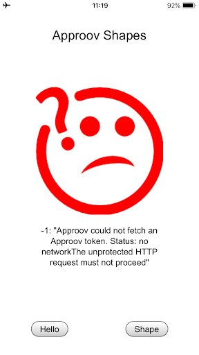
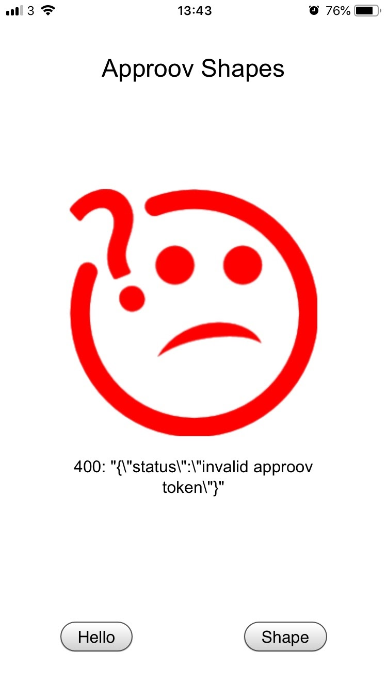
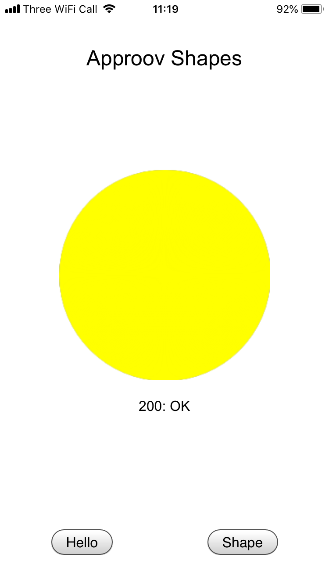

# Approov Quickstart: Cordova

This quickstart is written specifically for Android and iOS apps that are implemented using [`Cordova`](https://cordova.apache.org) and the [`Cordova Advanced HTTP networking plugin`](https://www.npmjs.com/package/cordova-plugin-advanced-http). If this is not your situation then check if there is a more relevant Quickstart guide available.

## WHAT YOU WILL NEED
* Access to a trial or paid Approov account
* The `approov` command line tool [installed](https://approov.io/docs/latest/approov-installation/) with access to your account
* The contents of the folder containing this README
* An iOS device if you are using the iOS platform. You may use an iOS simulator but the Approov SDK requires an actual iOS device in order to authenticate an application.
* XCode if targetting iOS development in order to edit codesigning options. Version 12.3 is used in this document.

## WHAT YOU WILL LEARN
* How to integrate Approov into a real app in a step by step fashion
* How to register your app to get valid tokens from Approov
* A solid understanding of how to integrate Approov into your own app that uses [`Cordova`](https://cordova.apache.org) and [`Cordova Advanced HTTP`](https://www.npmjs.com/package/cordova-plugin-advanced-http)
* Some pointers to other Approov features

## RUNNING THE SHAPES APP WITHOUT APPROOV
The Shapes App is a simple Cordova application written in Javascript, HTML and CSS, using the Cordova Advanced HTTP networking package.

<p>
    
</p>

The application consists mostly of boilerplate code, apart from the definitions of the shapes server’s URLs and setting up of the onclick callback for each of the buttons along the bottom of the screen.

The _Hello_ and _Shape_ buttons set up API requests to the shapes server, using the application’s http client. For example, the _Hello_ button initiates a `GET` request to the `shapes.approov.io/v1/hello` endpoint.

On a successful _hello_ request to `/v1/hello`, the client app will say hello with a smile, while a failure or unsuccessful response will return a frown with some explanation of the error. The purpose of this simple endpoint is really just to test connectivity and to verify that you have built, installed and run the demo app correctly.

<a>
    
</a>

<a>
    
</a>

Ensure that your system is set up for Cordova development by following the [Cordova Get Started](https://cordova.apache.org/#getstarted) and [Cordova Develop for Platforms](https://cordova.apache.org/docs/en/latest/index.html#develop-for-platforms) instructions.

To build and run the Cordova Shapes App, open a shell terminal at the `cordova-advanced-http/shapes-app` directory and type the following commands.

For Android:

```
$ cordova plugin add cordova-plugin-advanced-http@3.1.0
$ cordova platform add android
$ cordova build
$ cordova run
```

For iOS:

```
$ cordova plugin add cordova-plugin-advanced-http@3.1.0
$ cordova platform add ios
```

Running an iOS app requires codesigning. Open the Xcode project located in `cordova-advanced-http/shapes-app/platforms/ios/Cordova Approov Shapes.xcworkspace`:

```
$ open platforms/ios/Cordova\ Approov\ Shapes.xcworkspace
```

Select your code signing team in the `Signing & Capabilities` section of the project. Also ensure you modify the app's `Bundle Identifier` so it contains a unique string (you can simply append your company name). This is to avoid Apple rejecting a duplicate `Bundle Identifier` when code signing is performed. Then return to the shell and enter:

```
$ cordova build
$ cordova run
```

You should now be able to use the app to say hello and get shapes.

## ADDING APPROOV SUPPORT

### Add a request interceptor enabled version of the Cordova Advanced HTTP networking plugin

This plugin has been augmented to provide a generalized request interceptor mechanism, which is used to invoke Approov protection functionality.

In a terminal shell in your `cordova-advanced-http/shapes-app` directory, type:

For Android:

```
$ cordova platform remove android
$ cordova plugin remove cordova-plugin-advanced-http
$ cordova plugin add ../plugins/cordova-plugin-advanced-http
$ cordova platform add android
```

For iOS:

```
$ cordova platform remove ios
$ cordova plugin remove cordova-plugin-advanced-http
$ cordova plugin add ../plugins/cordova-plugin-advanced-http
$ cordova platform add ios
```

### Add the Latest Approov SDK

Currently, the underlying Approov SDK itself is not shipped as part of the `cordova-plugin-approov-http` module. To get the latest version of the SDK, use the [`approov` command line tool](https://approov.io/docs/latest/approov-installation/). In a terminal shell in your `cordova-advanced-http/shapes-app` directory, type:

For Android (if you are using Windows then substitute `approov` with `approov.exe` in all cases in this quickstart):

```
$ approov sdk -getLibrary ../plugins/cordova-plugin-approov-http/approov-sdk/approov-sdk.aar
```
This directly gets the SDK into the correct location in the plugin. On success, the tool outputs a message similar to this:

```
Android SDK library 2.6.0(3498) written to ../plugins/cordova-plugin-approov-http/approov-sdk/approov-sdk.aar
```

For iOS:
```
$ cd ../plugins/cordova-plugin-approov-http/approov-sdk
$ approov sdk -getLibrary Approov.xcframework
```
On success, the tool outputs a message similar to this:

```
$ iOS SDK library 2.6.0(5851) written to Approov.xcframework
$ cd -
```
This will write the Approov SDK framework into `Approov.xcframework` in the correct location in the plugin.

### Set up an Initial Approov Configuration

An Approov-enabled app requires a [configuration file](https://approov.io/docs/latest/approov-usage-documentation/#sdk-configuration) to initialize it. The Approov configuration is updated dynamically after subsequent launches of the app. Use the approov command-line tool in a shell to fetch a configuration file:

```
$ approov sdk -getConfig ../plugins/cordova-plugin-approov-http/approov-sdk/approov-initial.config
```

On success, the tool reports:

```
initial SDK configuration written to ../plugins/cordova-plugin-approov-http/approov-sdk/approov-initial.config
```

### Add the Approov Cordova Plugin

Approov protection is provided through the cordova-plugin-approov-http plugin for both, Android and iOS mobile platforms. This plugin handles all Approov related functionality, such as initialization, managing of initial and update configurations, fetching of Approov tokens, adding these to API requests as necessary, and manages certificate public key pinning. The plugin also requests all necessary network permissions.
In a shell in your `cordova-advanced-http/shapes-app directory`:

```
$ cordova plugin add ../plugins/cordova-plugin-approov-http
```

### Select the Correct Shapes Endpoint

The Shapes server provides the app with shapes using multiple versions of an API. Version 2 (https://shapes.approov.io/v2/shapes) requires an Approov token to be presented in the request to be successful.

Now that we’re using Approov, let’s switch to use version 2 of the Shapes API. Edit the Javascript source in cordova-advanced-http/shapes-app/www/js/index.js and change the Shapes server URLs to the v2 API path:

```
// Shapes server URLs
var HELLO_URL = "https://shapes.approov.io/v2/hello";
var SHAPE_URL = "https://shapes.approov.io/v2/shapes";
```

### Ensure the Shapes API is Added

In order for Approov tokens to be generated for `https://shapes.approov.io/v2/shapes` it is necessary to inform Approov about it. If you are using a demo account this is unnecessary as it is already set up. For a trial account do:

```
$ approov api -add shapes.approov.io
```

Tokens for this domain will be automatically signed with the specific secret for this domain, rather than the normal one for your account. After a short delay of no more than 30 seconds the new API settings become active.

### Build and Run the App Again

Build the app on your preferred platform. If you are targetting iOS, a physical device is needed since Approov does not authenticate apps running on iOS simulators. Please, remember to adjust your codesigning certificate options, since the iOS Project has been created again.

Run the app on a device or an emulator (Android only) and examine the logging. You should see in the logs that Approov is successfully fetching tokens, but the Shapes API is not returning valid shapes:

<p>
    
</p>

**Warning:** Never log tokens in a released app as this could permit hackers to harvest data from your API while the token has not expired! Always use _[loggable](https://www.approov.io/docs/latest/approov-usage-documentation/#loggable-tokens)_ Approov tokens for debugging.

## REGISTER YOUR APP WITH APPROOV

Although the application is now receiving and forwarding tokens with your API calls, the tokens are not yet properly signed, because the attestation service does not recognize your application. Once you register the app with the Approov service, untampered apps will attest successfully and begin to fetch and transmit valid tokens.

Approov command line tools are provided for Windows, MacOS, and Linux platforms. Select the proper operating system executable. In a shell in your `cordova-advanced-http/shapes-app` directory:

For Android:

```
$ approov registration -add platforms/android/app/build/outputs/apk/debug/app-debug.apk
    registering app Cordova Approov Shapes
    6k3T3YsesA1Qe8FKUoJU/sx/fmGcJSuVbrw0CzOGpJI=io.approov.demo.shapes.http.cordova-2.0.0[20000]-3498  SDK:Android(2.6.0)
    registration successful
```

For iOS:

```
$ approov registration -add platforms/ios/build/device/Cordova\ Approov\ Shapes.ipa
    registering app Cordova Approov Shapes
    eI8Z0dZWtG5O+kHwOj3RbRqh5LojsGZVoSrh5DQ4Mwc=io.approov.demo.shapes.http.cordova-2.0.0[2.0.0]-5851  SDK:iOS-universal(2.6.0)
    registration successful
```

## RUN THE SHAPES APP WITH APPROOV

Wait for the registration to propagate to the Approov service. This can take up to 30 seconds. Then restart the application on your device to flush out any bad tokens, tap _Shape_ and you should see one of four possible shapes::

<a>
    
</a>

<a>
    
</a>

<a>
    
</a>

<a>
    
</a>

Congratulations, your API is now Approoved!

## WHAT IF I DON'T GET SHAPES

If you still don't get a valid shape then there are some things you can try. Remember this may be because the device you are using has some characteristics that cause rejection for the currently set [Security Policy](https://approov.io/docs/latest/approov-usage-documentation/#security-policies) on your Approov account:

* Ensure that the version of the app you are running is exactly the one you registered with Approov.
* If you running the app from a debugger then valid tokens are not issued.
* Approov token data is logged to the console using a secure mechanism - that is, a _loggable_ version of the token is logged, rather than the _actual_ token for debug purposes. This is covered [here](https://www.approov.io/docs/latest/approov-usage-documentation/#loggable-tokens). The code which performs this is:

```
const result = await Approov.fetchApproovToken(url);
console.log("Fetched Approov token: " + result.loggableToken);
```

and the logged token is specified in the variable `result.loggableToken`.

The Approov token format (discussed [here](https://www.approov.io/docs/latest/approov-usage-documentation/#token-format)) includes an `anno` claim which can tell you why a particular Approov token is invalid and your app is not correctly authenticated with the Approov Cloud Service. The various forms of annotations are described [here](https://www.approov.io/docs/latest/approov-usage-documentation/#annotation-results).

If you have a trial (as opposed to demo) account you have some additional options:
* Consider using an [Annotation Policy](https://approov.io/docs/latest/approov-usage-documentation/#annotation-policies) during development to directly see why the device is not being issued with a valid token.
* Use `approov metrics` to see [Live Metrics](https://approov.io/docs/latest/approov-usage-documentation/#live-metrics) of the cause of failure.
* You can use a debugger and get valid Approov tokens on a specific device by ensuring it [always passes](https://approov.io/docs/latest/approov-usage-documentation/#adding-a-device-security-policy).

## USING TOKEN BINDING

It is possible to bind a string of arbitrary data to an Approov token (since Approov tokens can include the hash of an arbitrary data string) which can then be validated by your API.

To bind a data string, call the cordova-plugin-approov-http plugin’s `setDataHashInToken(data)` method.

A common usage for this ‘token binding’ feature is to bind a user’s login token (often an [OAuth2](https://oauth.net/2/) access token), typically specified in the `Authorization` header, to an Approov token thus combining both _user_ authentication and _app_ authentication for an optimal API protection solution. This way only the current authorized user can make API calls from this authenticated app.

In the Shapes v2 API, if the backend service finds a `pay` claim in the Approov token, it looks for an authorization bearer token in the request’s `Authorization` header. If one is found, the backend service will verify that the bearer token’s hash matches the Approov token’s `pay` claim. If the bearer token is not found, the backend service rejects the request.

## NEXT STEPS

This quick start guide has shown you how to integrate Approov with your existing app. Now you might want to explore some other Approov features:

* Managing your app [registrations](https://approov.io/docs/latest/approov-usage-documentation/#managing-registrations)
* Manage the [pins](https://approov.io/docs/latest/approov-usage-documentation/#public-key-pinning-configuration) on the API domains to ensure that no Man-in-the-Middle attacks on your app's communication are possible.
* Update your [Security Policy](https://approov.io/docs/latest/approov-usage-documentation/#security-policies) that determines the conditions under which an app will be given a valid Approov token.
* Learn how to [Manage Devices](https://approov.io/docs/latest/approov-usage-documentation/#managing-devices) that allows you to change the policies on specific devices.
* Understand how to provide access for other [Users](https://approov.io/docs/latest/approov-usage-documentation/#user-management) of your Approov account.
* Use the [Metrics Graphs](https://approov.io/docs/latest/approov-usage-documentation/#metrics-graphs) to see live and accumulated metrics of devices using your account and any reasons for devices being rejected and not being provided with valid Approov tokens. You can also see your billing usage which is based on the total number of unique devices using your account each month.
* Use [Service Monitoring](https://approov.io/docs/latest/approov-usage-documentation/#service-monitoring) emails to receive monthly (or, optionally, daily) summaries of your Approov usage.
* Learn about [automated approov CLI usage](https://approov.io/docs/latest/approov-usage-documentation/#automated-approov-cli-usage).
* Investigate other advanced features, such as [Offline Security Mode](https://approov.io/docs/latest/approov-usage-documentation/#offline-security-mode), [DeviceCheck Integration](https://approov.io/docs/latest/approov-usage-documentation/#apple-devicecheck-integration), [AppAttest Integration](https://approov.io/docs/latest/approov-usage-documentation/#apple-appattest-integration), [SafetyNet Integration](https://approov.io/docs/latest/approov-usage-documentation/#google-safetynet-integration) and [Android Automated Launch Detection](https://approov.io/docs/latest/approov-usage-documentation/#android-automated-launch-detection).


