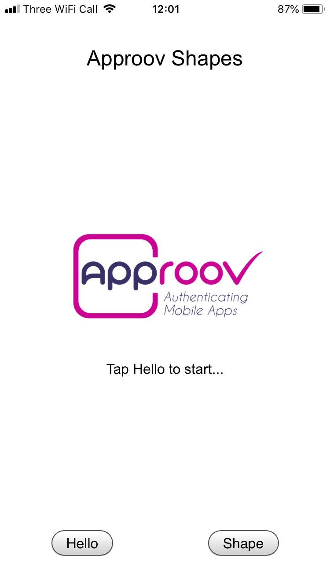
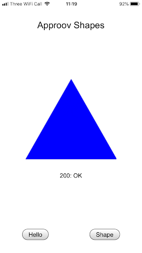
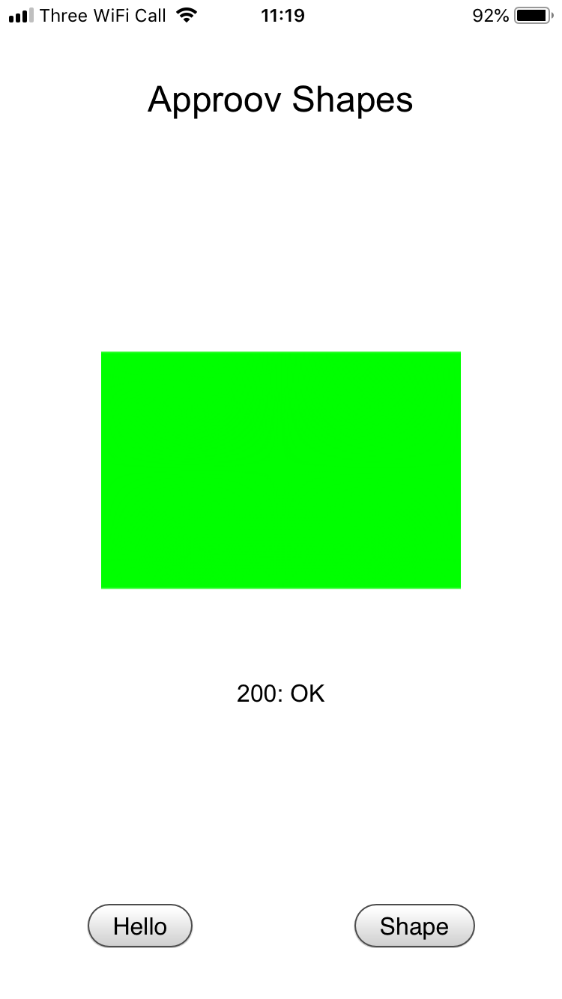

# Shapes Example

This quickstart is written specifically for Android and iOS apps that are implemented using [`Cordova`](https://cordova.apache.org) and the [`Cordova Advanced HTTP networking plugin`](https://www.npmjs.com/package/cordova-plugin-advanced-http). This quickstart provides a detailed step-by-step example of integrating Approov into an app using a simple `Shapes` example that shows a geometric shape based on a request to an API backend that can be protected with Approov.

## WHAT YOU WILL NEED
* Access to a trial or paid Approov account
* The `approov` command line tool [installed](https://approov.io/docs/latest/approov-installation/) with access to your account
* [Android Studio](https://developer.android.com/studio) installed (version Bumblebee 2021.1 is used in this guide) if you will build the Android app. Note that the `ANDROID_SDK_ROOT` value must be properly defined to allow the plugin to be built.
* [Gradle Build Tool](https://gradle.org/install/) installed if you are using Andorid (7.4.2 was used in this guide)
* [Xcode](https://developer.apple.com/xcode/) installed (version 13.3 is used in this guide) to build iOS version of application
* [iOS Deploy](https://www.npmjs.com/package/ios-deploy) must be installed if intend to run on iOS devices
* [Cocoapods](https://cocoapods.org) installed to support iOS building (1.11.3 used in this guide)
* An iOS device or simulator if you  are using the iOS platform
* An Android device or emulator if you are using the Android platform
* The content of this repo

## RUNNING THE SHAPES APP WITHOUT APPROOV

The app is initially setup to run the standard [`Cordova Advanced HTTP networking plugin`](https://www.npmjs.com/package/cordova-plugin-advanced-http).

Firstly, we need to add the platforms and the standard plugin. Open a shell terminal at the `cordova-advanced-http/shapes-app` directory and type the following:

```
cordova platform add android
cordova platform add ios
cordova plugin add cordova-plugin-advanced-http
```

Now we need to build and run the Cordova Shapes App. Type the following command for Android:

```
cordova run android
```

This builds the app for Android and runs it on a connected device.

Running an iOS app requires code signing. Open the Xcode project located in `cordova-advanced-http/shapes-app/platforms/ios/CordovaApproovShapes.xcworkspace`:

```
open platforms/ios/CordovaApproovShapes.xcworkspace
```

Select your code signing team in the `Signing & Capabilities` section of the project. Also ensure you modify the app's `Bundle Identifier` so it contains a unique string (you can simply append your company name). This is to avoid Apple rejecting a duplicate `Bundle Identifier` when code signing is performed. Then return to the shell and enter:

```
cordova run ios
```

You should now be able to use the app to say hello and get shapes. You will see two buttons:

<p>
    
</p>

Click on the `Say Hello` button and you should see this:

<a>
    
</a>

This checks the connectivity by connecting to the endpoint `https://shapes.approov.io/v1/hello`. Now press the `Get Shape` button and you will see this (or a different shape):

<a>
    
</a>

This contacts `https://shapes.approov.io/v1/shapes` to get the name of a random shape. This endpoint is protected with an API key that is built into the code, and therefore can be easily extracted from the app.

The subsequent steps of this guide show you how to provide better protection, either using an Approov Token or by migrating the API key to become an Approov managed secret.

## ADD THE APPROOV PLUGIN DEPENDENCY

In a shell terminal at the `cordova-advanced-http/shapes-app` directory, type the following commands:

```
cordova plugin remove cordova-plugin-advanced-http
cordova plugin add cordova-plugin-approov-advanced-http
```

This removes the standard plugin and installs the Approov capable plugin from [npm](https://www.npmjs.com/).

## ENSURE THE SHAPES API IS ADDED

In order for Approov tokens to be generated or secrets managed for the shapes endpoint, it is necessary to inform Approov about it. Execute the following command:

```
approov api -add shapes.approov.io
```

Note that any Approov tokens for this domain will be automatically signed with the specific secret for this domain, rather than the normal one for your account.

## MODIFY THE APP TO USE APPROOV

Uncomment the three lines of Approov initialization code in `cordova-advanced-http/shapes-app/www/js/index.js`:

```Javascript
cordova.plugin.http.approovInitialize("<enter-your-config-string-here>",
```

The Approov SDK needs a configuration string to identify the account associated with the app. It will have been provided in the Approov onboarding email (it will be something like `#123456#K/XPlLtfcwnWkzv99Wj5VmAxo4CrU267J1KlQyoz8Qo=`). Copy this and use it to replace the text `<enter-your-config-string-here>`.

You should also change the Shapes endpoint the app is using by uncommenting the line:

```Javascript
var SHAPE_URL = "https://shapes.approov.io/v3/shapes";
```

Remember to comment out the previous definition of `SHAPE_URL`.

## REGISTER YOUR APP WITH APPROOV

In a shell terminal at the `cordova-advanced-http/shapes-app` directory, type the following command to build the :

In order for Approov to recognize the app as being valid it needs to be built and registered with the service. Change directory to the top level of the `shapes-app` project and then register the app with Approov:

Approov command line tools are provided for Windows, MacOS, and Linux platforms. Select the proper operating system executable. In a shell in your `cordova-advanced-http/shapes-app` directory:

For Android:

```
cordova build android
approov registration -add platforms/android/app/build/outputs/apk/debug/app-debug.apk
```

For iOS:

```
cordova build ios
approov registration -add platforms/ios/build/device/CordovaApproovShapes.ipa -bitcode
```

Note, the `-bitcode` option must be used because the Cordova plugin uses the bitcode variant of the Approov SDK. If you are building and running on an iOS simulator then there will be no `.ipa` file and you must ensure the app [always passes](https://approov.io/docs/latest/approov-usage-documentation/#adding-a-device-security-policy) on your simulator without needing to perform a registration.

> **IMPORTANT:** The registration takes up to 30 seconds to propagate across the Approov Cloud Infrastructure, therefore don't try to run the app again before this time has elapsed. During development of your app you can ensure it [always passes](https://approov.io/docs/latest/approov-usage-documentation/#adding-a-device-security-policy) on your device to not have to register the app each time you modify it.

## SHAPES APP WITH APPROOV API PROTECTION

Do not make any further code changes and run the app again as follows, for Android:

```
cordova run android
```

For iOS:

```
cordova run ios
```

Press the `Get Shape` button. You should now see this (or another shape):

<a>
    
</a>

This means that the app is obtaining a validly signed Approov token to present to the shapes endpoint.

> **NOTE:** Running the app on an Android emulator will not provide valid Approov tokens. You will need to ensure it always passes on your the device (see below).

## WHAT IF I DON'T GET SHAPES

If you don't get a valid shape then there are some things you can try. Remember this may be because the device you are using has some characteristics that cause rejection for the currently set [Security Policy](https://approov.io/docs/latest/approov-usage-documentation/#security-policies) on your account:

* Ensure that the version of the app you are running is exactly the one you registered with Approov. Also, if you are running the app from a debugger then valid tokens are not issued.
* On Android, look at the [`logcat`](https://developer.android.com/studio/command-line/logcat) output from the device. You can see the specific Approov output using `adb logcat | grep ApproovService`. This will show lines including the loggable form of any tokens obtained by the app. You can easily [check](https://approov.io/docs/latest/approov-usage-documentation/#loggable-tokens) the validity and find out any reason for a failure.
* On iOS, look at the console output from the device using the [Console](https://support.apple.com/en-gb/guide/console/welcome/mac) app from MacOS. This provides console output for a connected simulator or physical device. Select the device and search for `ApproovService` to obtain specific logging related to Approov. This will show lines including the loggable form of any tokens obtained by the app. You can easily [check](https://approov.io/docs/latest/approov-usage-documentation/#loggable-tokens) the validity and find out any reason for a failure.
* Consider using an [Annotation Policy](https://approov.io/docs/latest/approov-usage-documentation/#annotation-policies) during initial development to directly see why the device is not being issued with a valid token.
* Use `approov metrics` to see [Live Metrics](https://approov.io/docs/latest/approov-usage-documentation/#live-metrics) of the cause of failure.
* You can use a debugger or emulator and get valid Approov tokens on a specific device by ensuring it [always passes](https://approov.io/docs/latest/approov-usage-documentation/#adding-a-device-security-policy). As a shortcut, when you are first setting up, you can add a [device security policy](https://approov.io/docs/latest/approov-usage-documentation/#adding-a-device-security-policy) using the `latest` shortcut as discussed so that the `device ID` doesn't need to be extracted from the logs or an Approov token.

## SHAPES APP WITH SECRETS PROTECTION

This section provides an illustration of an alternative option for Approov protection if you are not able to modify the backend to add an Approov Token check.

Firstly, revert any previous change to `cordova-advanced-http/shapes-app/www/js/index.js` for `SHAPE_URL` so that it uses `https://shapes.approov.io/v1/shapes/`, which simply checks for an API key.

The `API_KEY` should also be changed to `shapes_api_key_placeholder`, removing the actual API key out of the code.

We need to inform Approov that it needs to substitute the placeholder value for the real API key on the `Api-Key` header. Find this line and uncomment it:

```Javascript
cordova.plugin.http.approovAddSubstitutionHeader("Api-Key", "");
```

Next we enable the [Secure Strings](https://approov.io/docs/latest/approov-usage-documentation/#secure-strings) feature:

```
approov secstrings -setEnabled
```

> Note that this command requires an [admin role](https://approov.io/docs/latest/approov-usage-documentation/#account-access-roles).

You must inform Approov that it should map `shapes_api_key_placeholder` to `yXClypapWNHIifHUWmBIyPFAm` (the actual API key) in requests as follows:

```
approov secstrings -addKey shapes_api_key_placeholder -predefinedValue yXClypapWNHIifHUWmBIyPFAm
```

> Note that this command also requires an [admin role](https://approov.io/docs/latest/approov-usage-documentation/#account-access-roles).

Build, run and register the app again as follows. For Android:

```
cordova build android
approov registration -add platforms/android/app/build/outputs/apk/debug/app-debug.apk
cordova run android
```

Note, on Windows you need to substitute \ for / in the above commands.

For iOS:

```
cordova build ios
approov registration -add platforms/ios/build/device/CordovaApproovShapes.ipa -bitcode
cordova run ios
```

Run the app again without making any changes to the app and press the `Get Shape` button. You should now see this (or another shape):

<a>
    
</a>

This means that the registered app is able to access the API key, even though it is no longer embedded in the app configuration, and provide it to the shapes request.
