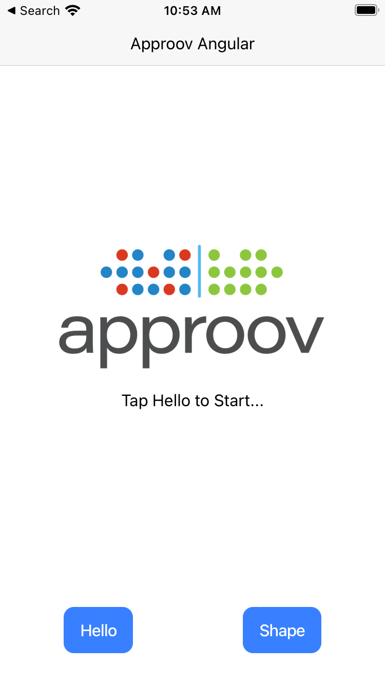

# Shapes Example

This quickstart is written specifically for Android and iOS apps that are implemented in [Ionic Capacitor](https://capacitorjs.com/) using the [`Cordova Advanced HTTP networking plugin`](https://www.npmjs.com/package/cordova-plugin-advanced-http), accessed via the [`HTTP plugin`](https://ionicframework.com/docs/native/http). This quickstart provides a detailed step-by-step example of integrating Approov into an app using a simple `Shapes` example that shows a geometric shape based on a request to an API backend that can be protected with Approov.

## WHAT YOU WILL NEED
* Access to a trial or paid Approov account
* [Android Studio](https://developer.android.com/studio) installed (version Chipmunk 2021.2.1 is used in this guide) if you will build the Android app. See information about [Android Development](https://ionicframework.com/docs/developing/android) for installation instructions. Note that the `ANDROID_HOME` value must be properly defined to allow building.
* [Xcode](https://developer.apple.com/xcode/) installed (version 13.4.1 is used in this guide) to build iOS version of application. See information about [iOS Development](https://ionicframework.com/docs/developing/ios) for installation instructions.
* [Cocoapods](https://cocoapods.org) installed to support iOS building (1.11.3 used in this guide)
* [NodeJS](https://nodejs.org/en/) v14+ installed in the system.
* [Ionic CLI](https://ionicframework.com/docs/intro/cli) installed in the system (note you may need to use `sudo` when using npm to install the Ionic CLI globally).
* The `approov` command line tool [installed](https://approov.io/docs/latest/approov-installation/) with access to your account
* An iOS device or simulator if you are using the iOS platform
* An Android device or emulator if you are using the Android platform
* The content of this repo

## RUNNING THE SHAPES APP WITHOUT APPROOV

A number of different variants of the shapes app are provided, namely `cap-angular`, `cap-react` and `cap-vue`, showing the use of different app flavours. This run through will use `cap-angular`, but it is possible to go through the steps using any of these different variants. Just be aware that the filenames and location of Approov specific commented out code may be different for the other variants.

Firstly, clone this repo and do the following to install dependencies in `cap-angular`:

```
cd demos/cap-angular
npm install
```

You can then run on either Android or iOS as follows:

### Android

If you wish to run on a physical Android device then connect it to your host platform over USB. See [Run apps on a hardware device](https://developer.android.com/studio/run/device) for full instructions. Use `adb devices` to verify that this device is connected and no other device or emulator is running.

Firstly you need to prepare the Android build with:

```
ionic cap sync android
```

and then you can run the app on your device or emulator with:

```
ionic cap run android
```

### iOS

Firstly you need to prepare the iOS build with:

```
ionic cap sync ios
```

and then you can run the app on your device or simulator with:

```
ionic cap run ios
```

Note that if running on a device, you may need to update the project with signing information. You can force Ionic to open the Xcode project to do this by executing `ionic cap build ios`.

Note that if you see the message `Error: Invalid checksum received from debugserver` when trying to run on a physical device then this may be because the developer certificate is not trusted on the device. To solve this issue on the device, go to `Settings > General > Profiles or Settings > General > Device Management` on the device, depending on the device type and the iOS version, and trust the developer and allow the apps to be run.

### Android and iOS

You should see an Approov Shapes app running. This is a plain Ionic app and Approov is not installed as this stage.

<p>
    
</p>

There are two buttons on the app. Pressing `Hello` will call the `shapes.approov.io` server's unprotected connectivity check endpoint `/v1/hello`, and this should succeed:

<p>
    
</p>

The `Shape` button requests a random shape from the API key protected `/v1/shapes` endpoint. This should succeed and you should see a successful shapes call with this (or another shape):

<p>
    
</p>

This endpoint is protected with an API key that is built into the code, and therefore can be easily extracted from the app. The subsequent steps of this guide show you how to provide better protection, either using an Approov Token or by migrating the API key to become an Approov managed secret.

## ADD THE APPROOV PLUGIN

In a shell terminal in the `demos/cap-angular` directory, type the following command to first uninstall the non-Approov plugins:

```
npm uninstall @awesome-cordova-plugins/http 
npm uninstall cordova-plugin-advanced-http
```

Next add the Approov capable version of the advanced HTTP plugin and its `@awesome-cordova-plugins` wrapper:

```
npm install @approov/cordova-plugin-advanced-http
npm install @awesome-cordova-plugins/approov-advanced-http
```

## ENSURE THE SHAPES API IS ADDED

In order for Approov tokens to be generated or secrets managed for the shapes endpoint, it is necessary to inform Approov about it. Execute the following command:

```
approov api -add shapes.approov.io
```

Note that any Approov tokens for this domain will be automatically signed with the specific secret for this domain, rather than the normal one for your account.

## MODIFY THE APP TO USE APPROOV

Uncomment the marked lines in the `src/app/app.component.ts` file:

```Typescript
import { HTTP, HTTPResponse } from '@awesome-cordova-plugins/approov-advanced-http/ngx';
```
Remember to comment out the previous `import`. Next uncomment the following:

```Typescript
this.http.approovInitialize("<enter-your-config-string-here>");
```

The Approov SDK needs a configuration string to identify the account associated with the app. It will have been provided in the Approov onboarding email (it will be something like `#123456#K/XPlLtfcwnWkzv99Wj5VmAxo4CrU267J1KlQyoz8Qo=`). Copy this to replace the text `<enter-your-config-string-here>`.

You should also change the Shapes endpoint the app is using by changing the marked line:

```Typescript
readonly VERSION: string = 'v3'; 
```

## REGISTER YOUR APP WITH APPROOV

Next you need to register the built app with Approov so that it recognizes it.

> **IMPORTANT:** The registration takes around 30 seconds to propagate across the Approov Cloud Infrastructure, therefore don't try to run the app again before this time has elapsed. During development of your app you can ensure it [always passes](https://approov.io/docs/latest/approov-usage-documentation/#adding-a-device-security-policy) on your device to not have to register the app each time you modify it.

### Android

Build and run the updated app again as follows:

```
ionic cap sync android
ionic cap run android
```

Now register the built app with Approov as follows:

```
approov registration -add android/app/build/outputs/apk/debug/app-debug.apk
```

### iOS

If you run on a physical device then you will need to register an `.ipa` file. Since obtaining this is quite involved we suggest that you instead ensure that attestation [always passes](https://approov.io/docs/latest/approov-usage-documentation/#adding-a-device-security-policy) on a specific device. Launch the app using:

```
ionic cap sync ios
ionic cap run ios
```

and press the `Shape` button to try and obtain a shape. This will fail with an error, but you can now make the device always pass by executing:

```
approov device -add latest -policy default,always-pass,all
```

Note, that since a bitcode SDK is being used, this normally requires a registration to have been made. To work around this, issue the following command:

```
approov sdk -bitcodeAdd 6557
```

## SHAPES APP WITH APPROOV API PROTECTION

Do not make any further code changes and run the app again with either `ionic cap run android` or `ionic cap run ios`. Now press the `Shape` button. You should now see this (or another shape):

<p>
    
</p>

This means that the app is obtaining a validly signed Approov token to present to the shapes endpoint.

> **NOTE:** Running the app on an Android emulator or iOS simulator will not provide valid Approov tokens. You will need to ensure it always passes on your the device (see below).

## WHAT IF I DON'T GET SHAPES

If you don't get a valid shape then there are some things you can try. Remember this may be because the device you are using has some characteristics that cause rejection for the currently set [Security Policy](https://approov.io/docs/latest/approov-usage-documentation/#security-policies) on your account:

* Ensure that the version of the app you are running is exactly the one you registered with Approov. Also, if you are running the app from a debugger then valid tokens are not issued.
* On Android, look at the [`logcat`](https://developer.android.com/studio/command-line/logcat) output from the device. You can see the specific Approov output using `adb logcat | grep ApproovService`. This will show lines including the loggable form of any tokens obtained by the app. You can easily [check](https://approov.io/docs/latest/approov-usage-documentation/#loggable-tokens) the validity and find out any reason for a failure.
* On iOS, look at the console output from the device using the [Console](https://support.apple.com/en-gb/guide/console/welcome/mac) app from MacOS. This provides console output for a connected simulator or physical device. Select the device and search for `ApproovService` to obtain specific logging related to Approov. This will show lines including the loggable form of any tokens obtained by the app. You can easily [check](https://approov.io/docs/latest/approov-usage-documentation/#loggable-tokens) the validity and find out any reason for a failure.
* Consider using an [Annotation Policy](https://approov.io/docs/latest/approov-usage-documentation/#annotation-policies) during initial development to directly see why the device is not being issued with a valid token.
* Use `approov metrics` to see [Live Metrics](https://approov.io/docs/latest/approov-usage-documentation/#live-metrics) of the cause of failure.
* You can use a debugger, simulator or emulator and get valid Approov tokens on a specific device by ensuring it [always passes](https://approov.io/docs/latest/approov-usage-documentation/#adding-a-device-security-policy). As a shortcut, when you are first setting up, you can add a [device security policy](https://approov.io/docs/latest/approov-usage-documentation/#adding-a-device-security-policy) using the `latest` shortcut as discussed so that the `device ID` doesn't need to be extracted from the logs or an Approov token.

## SHAPES APP WITH SECRETS PROTECTION

This section provides an illustration of an alternative option for Approov protection if you are not able to modify the backend to add an Approov Token check.

Firstly, revert any previous change to `VERSION` in `src/app/app.component.ts` so that it is:

```Typescript
readonly VERSION: string = 'v1'; 
```

The `API_KEY` should also be changed to be defined as `shapes_api_key_placeholder` by uncommenting the appropriate code. This removes the actual API key out of the code.

We need to inform Approov that it needs to substitute the placeholder value for the real API key on the `Api-Key` header. Find this line within the file and uncomment it:

```Typescript
this.http.approovAddSubstitutionHeader("Api-Key", "");
```

Next we enable the [Secure Strings](https://approov.io/docs/latest/approov-usage-documentation/#secure-strings) feature:

```
approov secstrings -setEnabled
```

> Note that this command requires an [admin role](https://approov.io/docs/latest/approov-usage-documentation/#account-access-roles).

You must inform Approov that it should map `shapes_api_key_placeholder` to `yXClypapWNHIifHUWmBIyPFAm` (the actual API key) in requests as follows:

```
approov secstrings -addKey shapes_api_key_placeholder -predefinedValue yXClypapWNHIifHUWmBIyPFAm
```

> Note that this command also requires an [admin role](https://approov.io/docs/latest/approov-usage-documentation/#account-access-roles).

Build, run and register the app again as follows.

For Android, run the app again to force it to be rebuilt:

```
ionic cap run android
```

Quit the app then register it with:

```
approov registration -add android/app/build/outputs/apk/debug/app-debug.apk
```

Before running it again with:

```
ionic cap run android
```

For iOS, where it is assumed that you are using a device or simulator which you have already forced to always pass in the API protection step, so no further registration is needed.

Run the app again without making any changes to the app and press the `Shape` button. You should now see this (or another shape):

<p>
    
</p>

This means that the registered app is able to access the API key, even though it is no longer embedded in the app code, and provide it to the shapes request.
